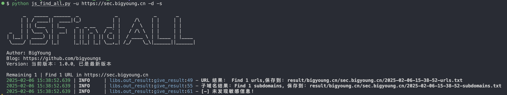
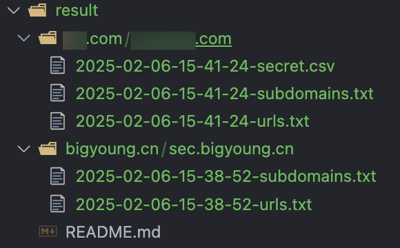
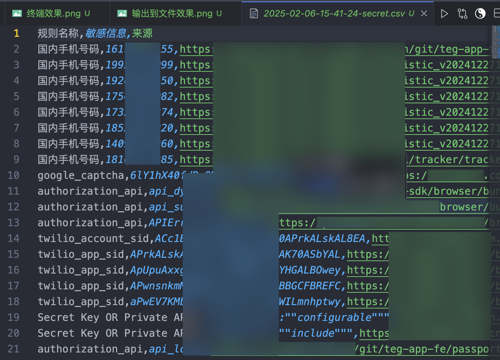
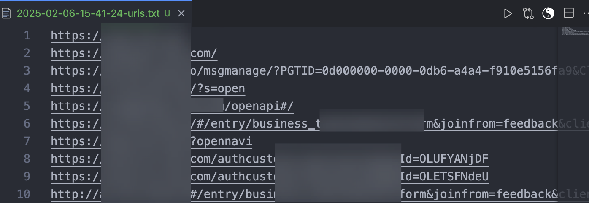
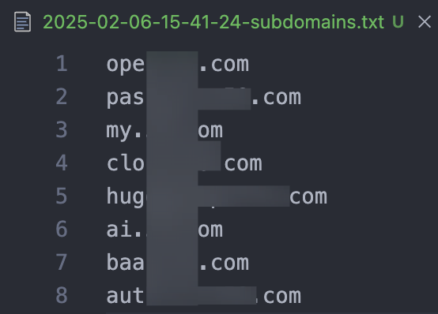

# JS_Find_ALL

## 主要功能

- 通过url链接获取所有的url、敏感信息、subdomain，此方式支持深度查找
- 通过读取文件中的所有链接，然后批量获取所有的url、敏感信息、subdomain，此方式支持深度查找
- 通过读取指定目录下的所有本地js文件，然后批量获取所有的url、敏感信息、subdomain，此方式暂不支持深度查找
- 扫描结果导出到txt和csv

## 使用方法

```shell
简单用法：
python3 js_find_all.py -u http://www.test.com

深度扫描：
python3 js_find_all.py -u http://www.test.com -d 

添加cookies：
python3 js_find_all.py -u http://www.test.com -d -c "cookie"

批量读取urls文件：
python3 js_find_all.py -f urls.txt

批量读取本地js文件，指定js存放目录即可：
python3 js_find_all.py -j /home/targets/js_files -t https://target.com

读取本地js文件，指定js文件路径：
python3 js_find_all.py -j /home/targets/js_files/test.js -t https://target.com

搜索敏感信息：
python3 js_find_all.py -u http://www.test.com -s 

-s 为检测敏感信息，-d 为深度扫描，-c 为添加cookies，这三个为可选参数，均可配合-u、-f、-j 一起使用
```

## 效果

终端输出：



输出到文件：



敏感信息：



urls信息：



子域名信息：



## 常见问题

**Q: 为什么`-f`参数，需要指定`-t`参数？**

Q: 指定`-f`时，读取的是本地js文件，如果不指定目标站点地址，js文件中的相对地址无法拼接，以及子域名也无法查找。

如有其他问题，请在以下链接内进行反馈，或者微信反馈。

[https://afdian.net/group/37beff8aadd211ee90945254001e7c00](https://afdian.net/group/37beff8aadd211ee90945254001e7c00)

## 版本记录

### V 1.0.0

1. 【功能】完成url、子域名、敏感信息获取功能
2. 【修复】批量读取文件里的js时，js批量文件读取后，处理url时，url拼接不完整导致的Bug；

### V 1.1.0

1. 【新增】增加读取本地js文件功能，方便已经收集了js文件的场景。需使用`-j`参数
2. 【优化】优化命令参数，如需检测敏感信息和深度扫描，直接使用`-s -d`，以前是`-s 1 -d 1`；
3. 【优化】`-u`参数统一处理站点url或js链接，简化使用
4. 【优化】`-d`深度查找逻辑优化，支持url、file模式，暂不支持本地js文件的深度查找
5. 【优化】结果输出到文件中时，以域名为文件夹进行分类存放，便于查找和后期查看
6. 【优化】敏感信息检测结果输出到csv文件，便于后续查看和管理
7. 【修复】开启深度查找时，以前会忽略掉目标站点，此版本修复了这个问题

## TODO

- [x]  增加读取本地js文件的功能；@完成时间：2025-02-05
- [ ]  使用`-u https://test.com -d 1` 时，deep深度查找对于页面动态加载的，无法获取内容；
- [ ]  特殊URL提出导出功能，如：管理后台、管理端；

## 免责声明

JS_Find_ALL 仅供安全自测、获得合法授权的测试，以及代码学习交流使用，禁止用于非法用途，否则后果自负，项目开发者BigYoung与此无关。下载代码即代表认可此声明，请知晓风险后再下载。

## 版权声明

JS_Find_ALL 本软件，通过[爱发电BigYoung商铺]([https://afdian.net/a/bigyoung?tab=shop](https://afdian.net/a/bigyoung?tab=shop))购买后，有权进行个人使用以及二开，禁止公开发布和用于商业用途，否则BigYoung有权追究法律责任。

## 下载地址&获取最新版

**主链接：**[https://afdian.net/a/bigyoung?tab=shop](https://afdian.net/a/bigyoung?tab=shop) 页面，搜“JS_Find_ALL”。


**备用链接：**[https://mbd.pub/o/bread/mbd-ZpiblJdu](https://mbd.pub/o/bread/mbd-ZpiblJdu)
