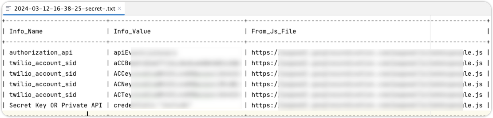

# JS_Find_ALL

## 主要功能

- 通过url链接获取所有的url、敏感信息、subdomain
- 通过读取文件批量获取所有的url、敏感信息、subdomain
- 扫描结果导出到txt文件

## 使用方法

```shell
简单用法：
python3 js_find_all.py -u http://www.test.com

深度扫描：
python3 js_find_all.py -u http://www.test.com -d 1

添加cookies：
python3 js_find_all.py -u http://www.test.com -d 1 -c "cookie"

批量读取urls文件：
python3 js_find_all.py -f urls.txt

批量读取js文件：
python3 js_find_all.py -f js.txt -j 1

搜索敏感信息：
python3 js_find_all.py -u http://www.test.com -s 1

-s 为输出敏感信息，-d 为深度扫描，-c 为添加cookies，这三个为可选参数
```

## 效果：

终端输出：


输出到文件：


敏感信息：



urls信息：


子域名信息：


## 常见问题：

**Q：使用`-f` 参数时，文件中都是js链接，但是无任何结果？** 

A：文件中都是js链接时，需要使用`-j 1`参数，否则无法正常检测js内容。

如有其他问题，请在以下链接内进行反馈。

[https://afdian.com/group/37beff8aadd211ee90945254001e7c00](https://afdian.com/group/37beff8aadd211ee90945254001e7c00)

## 版本记录：

### V 1.0.0

1. 本工具重点参考项目：[JSFind](https://github.com/Threezh1/JSFinder/tree/master)、[js_info_finder](https://github.com/laohuan12138/js_info_finder)
2. 以上两个工具的整合，代码结构优化，细微Bug处理；
3. 【修复】批量读取文件里的js时，js批量文件读取后，处理url时，url拼接不完整导致的Bug；

## TODO：

- [ ]  使用`-u https://test.com -d 1` 时，deep深度查找对于页面动态加载的，无法获取内容；
- [ ]  特殊URL提出导出功能，如：管理后台、管理端；

## 免责声明

JS_Find_ALL 仅供安全自测、获得合法授权的测试，以及代码学习交流使用，禁止用于非法用途，否则后果自负，项目开发者BigYoung与此无关。下载代码即代表认可此声明，请知晓风险后再下载。

## 版权声明

JS_Find_ALL 本软件，通过[爱发电BigYoung商铺]([https://afdian.com/a/bigyoung?tab=shop](https://afdian.com/a/bigyoung?tab=shop))购买后，有权进行个人使用以及二开，禁止公开发布和用于商业用途，否则BigYoung有权追究法律责任。

## 下载地址&获取最新版

**主要链接：**[https://afdian.com/a/bigyoung?tab=shop](https://afdian.com/a/bigyoung?tab=shop) 页面，搜“JS_Find_ALL”。

**备用链接：**[https://mbd.pub/o/bread/mbd-ZpiblJdu](https://mbd.pub/o/bread/mbd-ZpiblJdu)
